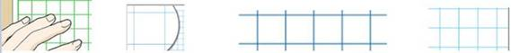

# Squares-Detaction
## Description
Finds and marks all the squares in the image.
**Input:** image.
**Output:** marked image.

## Usage
### Interface
Here is an example of the script usage with some arguments
```
python find_squares.py --img_path image001.jpg --color 0 0 255 --thickness 2
```
After running the script the marked image saved on the folder of the script.

### Arguments
* '''--img_path''' - Path for the input image
* '''--color''' - Color to mark the squares with
* '''--thickness''' - thickness line of the marks

## Example

